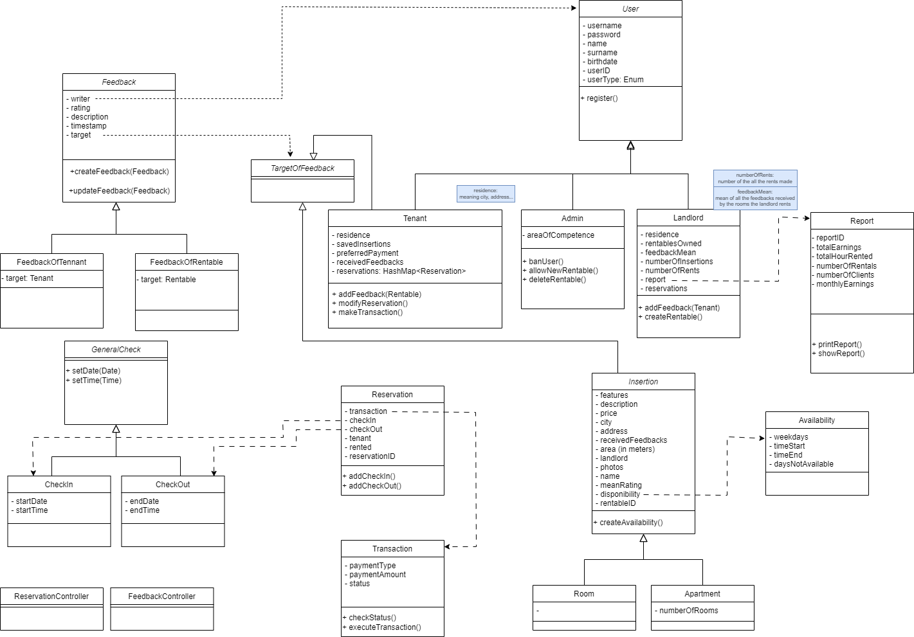

# HourRoom
Project for TAAS course UniTo 2023/24
## Class Diagram


## Starting the Project
``` bash
❯ minikube start
```

Install Kong[^1] to manage the gateway:
``` bash
❯ kubectl apply -f https://github.com/kubernetes-sigs/gateway-api/releases/download/v1.0.0/standard-install.yaml
❯ helm repo add kong https://charts.konghq.com
❯ helm repo update
❯ helm install kong kong/ingress -n kong --create-namespace 
```

Port-forward for ease of access:
``` bash
❯ kubectl port-forward services/kong-gateway-proxy -n kong 8888:80 & &>/dev/null
```

Apply all the kubernetes files:
``` bash
❯ kubectl apply -f kubernetes
```

Check the status of the deployments:
``` bash
❯ kubectl get pods
```

The web-app is accessible at http://localhost:8888.
Services are accessible through the kong gateway at http://localhost:8888/api/v1/name

Test them with curl:
``` bash
curl -v http://localhost:8888/api/v1/insertion
```

[^1]: See https://docs.konghq.com/kubernetes-ingress-controller/latest/get-started/

## Building
To build the modules use the docker-compose like so:
``` bash
❯ docker compose build insertion-microservice
```
To build everything:
``` bash
❯ docker compose build
```
